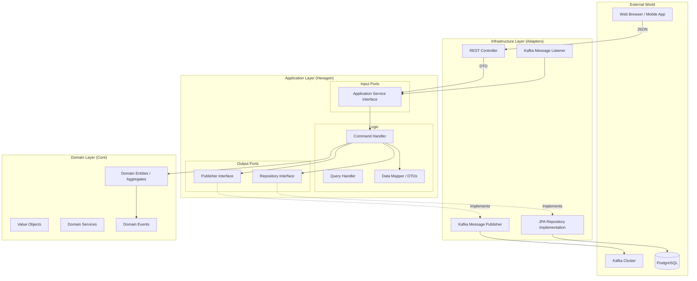
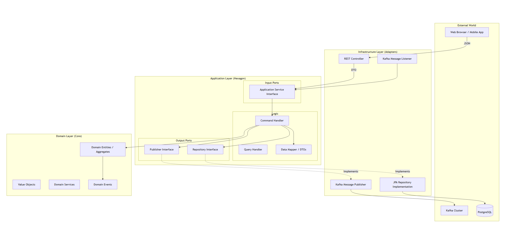
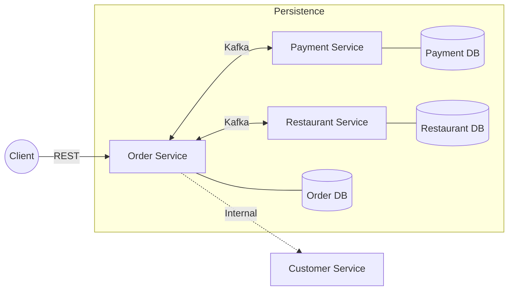
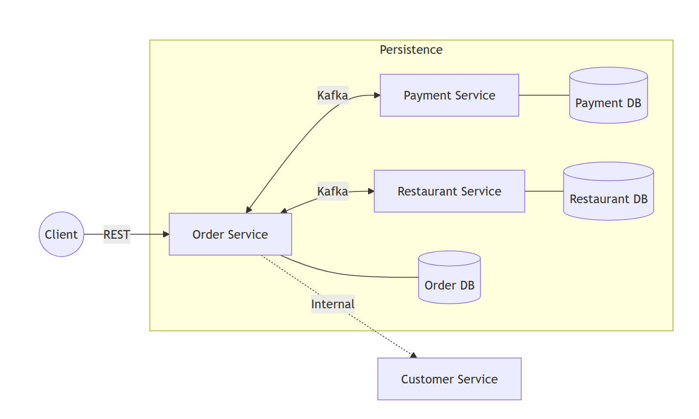
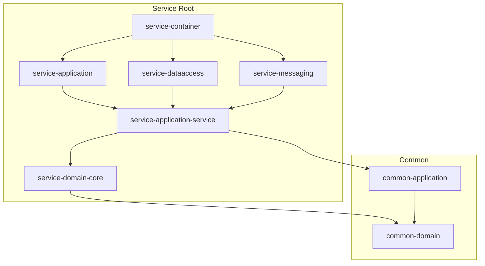
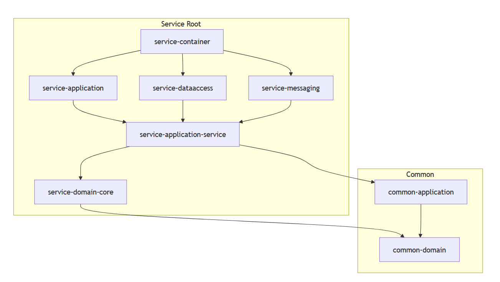
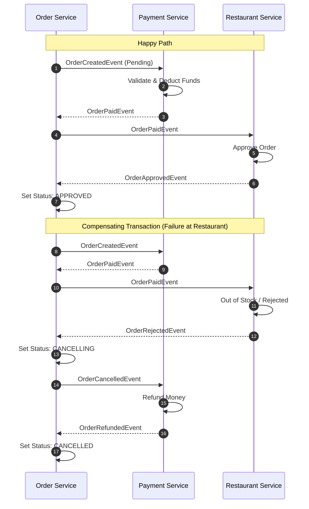
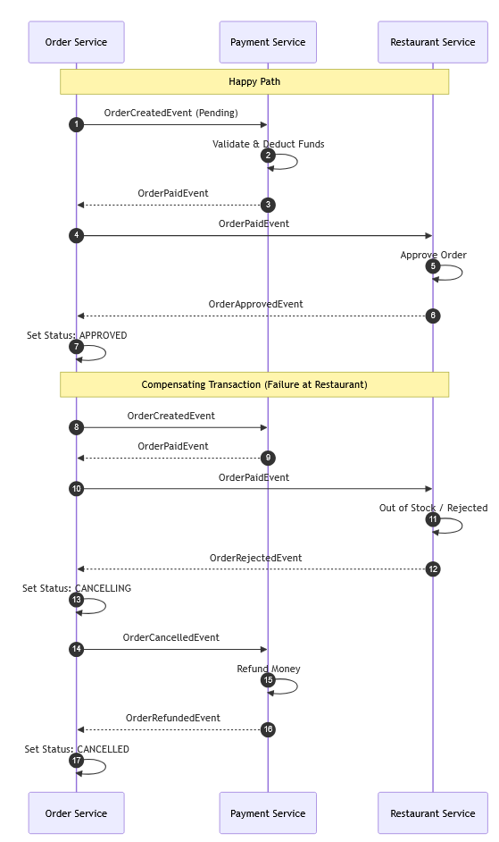

# Architecture Overview - Food Ordering System

This document provides a high-level overview of the architectural patterns, technologies, and structural design used in the Food Ordering System.

## 🏗 Architectural Patterns

The system is designed following modern microservices principles to ensure scalability, maintainability, and reliability.

- **Clean Architecture & Hexagonal Architecture**: Separation of concerns by decoupling the core business logic (Domain) from external concerns (Frameworks, Databases, Messaging).
- **Domain-Driven Design (DDD)**: The system is structured around rich domain models, using entities, value objects, aggregates, and domain services.
- **SAGA Pattern (Orchestration)**: Manages distributed transactions across multiple microservices (Order, Payment, Restaurant) to ensure eventual consistency.
- **Transactional Outbox Pattern**: Ensures "at-least-once" delivery of events to Kafka by persisting them in the database before publishing.
- **CQRS (Command Query Responsibility Segregation)**: Separates read and write operations for optimized performance and scalability.

### Hexagonal Architecture (Detailed Flow)

## 🛠 Technology Stack

- **Language**: Java 17
- **Framework**: Spring Boot 3.x
- **Database**: PostgreSQL (Relational storage for each service)
- **Messaging**: Apache Kafka (Event-driven communication)
- **Containerization**: Docker & Docker Compose
- **Build Tool**: Maven

## 📦 Microservices

The system consists of the following core services:

1.  **Customer Service**: Manages customer profiles and information.
2.  **Order Service**: The central orchestrator for the food ordering process.
3.  **Payment Service**: Handles payment processing and validation.
4.  **Restaurant Service**: Manages restaurant information and order approval logic.

### System Components & Communication

## 📂 Internal Module Structure (Typical Service)

Each microservice is divided into several modules to enforce Hexagonal Architecture:

- **`service-domain-core`**: Contains pure domain logic (Entities, Value Objects, Domain Events). No dependencies on frameworks.
- **`service-application-service`**: Implements use cases via Command and Query handlers. Defines Input/Output ports (Interfaces).
- **`service-application`**: Contains the REST API controllers and global exception handlers.
- **`service-dataaccess`**: Implementation of repository ports for PostgreSQL using Spring Data JPA.
- **`service-messaging`**: Implementation of messaging ports for Kafka (Publishers and Listeners).
- **`service-container`**: The entry point of the application, responsible for dependency injection and configuration.

### Package Dependency Diagram

## 🏗 Common & Infrastructure

- **`common`**: Contains shared libraries used across all services:
    - `common-domain`: Shared value objects (e.g., `Money`, `OrderId`) and base classes.
    - `common-application`: Shared application-level exceptions and DTOs.
- **`infrastructure`**: Provides global infrastructure configurations:
    - `kafka`: Shared Kafka configuration and utilities.
    - `docker-compose`: YAML files for spinning up Kafka, Zookeeper, and Postgres clusters.

## 🔄 Communication Flow

1.  **Synchronous**: External clients communicate with the services via **REST APIs**.
2.  **Asynchronous**: Services communicate with each other using **Kafka Events**.
    - For example, when an order is created, `Order Service` publishes an `OrderCreatedEvent` to Kafka, which is then consumed by `Payment Service`.

## 🛡 Reliability & Consistency

- **Distributed Transactions**: Handled by the SAGA orchestrator in the `Order Service`.
- **Event Integrity**: The **Outbox Pattern** ensures that domain events are never lost, even if the messaging broker is temporarily unavailable.
- **State Management**: SAGA states (PENDING, PAID, APPROVED, CANCELLED, etc.) are tracked to manage the lifecycle of an order.

### SAGA Flow (Detailed with Rollback)

The SAGA pattern handles both the successful path and the failure path (Compensating Transactions) to ensure data consistency.

