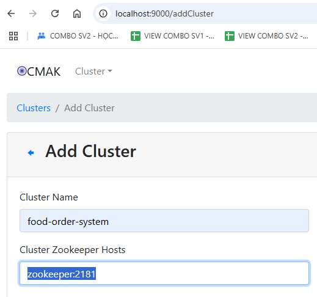

<h3>zookeeper terminal:</h3>
docker-compose -f common.yml -f zookeeper.yml up

<h3> kafka_cluster terminal:</h3>
docker-compose -f common.yml -f kafka_cluster.yml up

<h3> init_kafka terminal:</h3>
docker-compose -f common.yml -f init_kafka.yml up 

<h3> http://localhost:9000/</h3>

